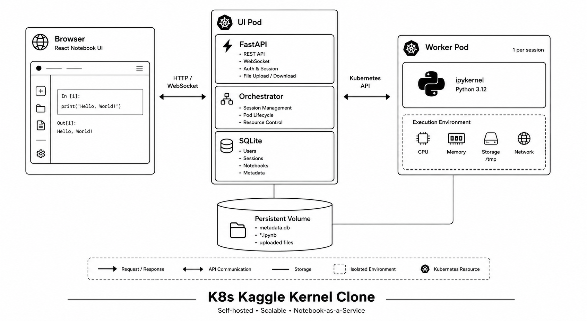

<h1 align="center">K8s Kaggle Kernel Clone</h1>

<p align="center">
  Self-hosted notebook platform — one notebook, one Kubernetes pod, zero local setup.
</p>

<p align="center">
  <a href="#demo">Demo</a> •
  <a href="#architecture">Architecture</a> •
  <a href="#running-locally-on-macos">Installation</a> •
  <a href="#how-it-works--session-flow">Session Flow</a>
</p>

<br>

<a id="demo"></a>

<p align="center">
  <video
    src="https://github.com/muhammadibrahim313/k8s-kaggle-kernel-clone/raw/main/assets/demo.mp4"
    width="900"
    controls
  >
  </video>
</p>

<p align="center">
  <sub>Create notebook → start session → run code → upload CSV → load with pandas</sub>
</p>

<br>

---

## What This Is

Kaggle Kernels let you write and execute Python notebooks in the browser without setting up anything locally. Every time you start a session, Kaggle spins up a fresh, isolated environment just for your notebook. When you stop, it tears it down.

This project replicates that core mechanic — a notebook interface backed by live Jupyter kernels running in Kubernetes pods, with a start/stop session model like Kaggle.

---

## Architecture

<a id="architecture"></a>

```
Browser
  └── HTTP / WebSocket ──► UI Pod (FastAPI + React)
                                └── spawns ──► Worker Pod (Jupyter Kernel)
                                                   └── reads/writes ──► Persistent Volume
```

<p align="center">
  
</p>

### Components

#### UI Pod
Single Kubernetes deployment running:

- **React frontend** — notebook editor with CodeMirror cells, markdown cells, dataset sidebar, real-time output (text, HTML, images, errors), session controls in a sticky top bar
- **FastAPI backend** — REST API for notebook CRUD, file upload, session management, WebSocket proxy for kernel output
- **Orchestrator** — Kubernetes Python client spawns and kills Worker Pods on demand; session state in SQLite

#### Worker Pod
One pod per active session, created on **Start Session**, destroyed on **Stop Session**.

- Runs an `ipykernel` Python process (variables persist across cells)
- Internal HTTP API: `/execute`, `/interrupt`, `/restart`, `/status`
- Browser never talks to Worker Pods directly

#### Persistent Volume

```
/data/
├── metadata.db
├── notebooks/{id}.ipynb
└── files/{notebook_id}/     ← uploaded datasets
```

---

## Tech Stack

| Layer | Technology |
|---|---|
| Frontend | React 18, TypeScript, Vite, CodeMirror 6 |
| Backend | FastAPI, SQLAlchemy, SQLite |
| Kernel | ipykernel, jupyter-client |
| Orchestration | Kubernetes Python client |
| Packaging | Docker, Helm |
| Local cluster | Minikube |

---

## Running Locally on macOS

<a id="running-locally-on-macos"></a>

### Prerequisites

Install before running:

- [Docker Desktop](https://docs.docker.com/get-docker/) — **must be running** before `minikube start`
- [Minikube](https://minikube.sigs.k8s.io/docs/start/) — `brew install minikube`
- [Helm](https://helm.sh/docs/intro/install/) — `brew install helm`
- [kubectl](https://kubernetes.io/docs/tasks/tools/) — included with Minikube

### 1. Start Minikube

```bash
minikube start
```

### 2. Deploy

```bash
# First deploy — builds Docker images and installs Helm chart
./deploy.sh --build

# Later deploys — reinstalls chart without rebuilding images
./deploy.sh
```

The script:

- Enables the ingress addon
- Builds images into Minikube's Docker daemon (`eval $(minikube docker-env)`)
- Creates the `kaggle-kernel` namespace
- Uninstalls any existing release, cleans up worker pods and PVCs safely
- Installs the Helm chart
- Port-forwards to **http://localhost:8080**

### 3. Optional — Ingress via hosts file

```bash
minikube ip
# Add to /etc/hosts:  <minikube-ip>  notebook.local
```

Then open `http://notebook.local`. Otherwise use `http://localhost:8080`.

### 4. Watch the cluster

```bash
kubectl get pods -n kaggle-kernel -w
kubectl logs -n kaggle-kernel deployment/kaggle-kernel-ui -f
```

---

## How It Works — Session Flow

<a id="how-it-works--session-flow"></a>

1. **Create a notebook** → saved as `.ipynb`, no pod yet
2. **Start Session** → Worker Pod spawns, status shows `starting` then `idle`
3. **Run a cell** → code over WebSocket → ipykernel → output streams back
4. **Upload data** → **Data** button in top bar → upload CSV → click **path** to copy → use in `pd.read_csv("...")`
5. **Stop Session** → notebook saved, pod killed, kernel state cleared

### Keyboard shortcuts

| Key | Action |
|-----|--------|
| Shift+Enter | Run focused cell |
| A | Add cell above |
| B | Add cell below |
| M | Toggle code ↔ markdown |

---

## Project Structure

```
├── ui-pod/                 FastAPI + React
├── worker-pod/             ipykernel service
├── helm/kaggle-kernel/     Kubernetes chart
├── assets/
│   ├── demo.mp4            Demo video
│   └── architecture.png    Architecture diagram
└── deploy.sh               One-command deploy
```

---

<p align="center">
  <sub>Inspired by <a href="https://github.com/mageshkrishna/k8s-kaggle-kernel-clone">mageshkrishna/k8s-kaggle-kernel-clone</a></sub>
</p>
